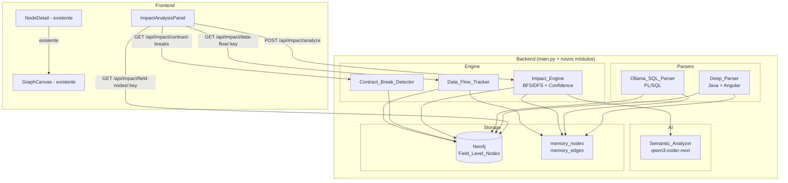
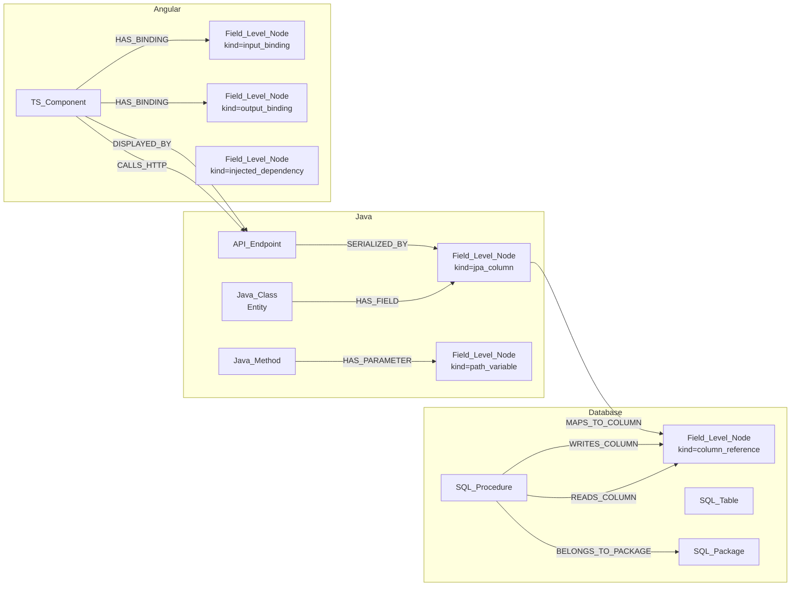

# Design Document — Advanced Impact Analysis

## Overview

O **Advanced Impact Analysis** eleva o InsightGraph de visualizador de arquitetura para analisador de impacto de nível de produção, equivalente ao CAST Imaging. A feature adiciona três capacidades principais ao sistema existente:

1. **Deep Parsing** — extração de metadados em nível de campo, parâmetro, coluna e anotação para Java, PL/SQL e Angular/TypeScript.
2. **Impact Engine** — motor de cálculo de impacto que percorre o grafo Neo4j (ou fallback em memória) para determinar o conjunto completo de artefatos afetados por uma mudança proposta.
3. **Semantic Analysis** — uso do modelo `qwen3-coder-next:q4_K_M` para gerar explicações em linguagem natural, estimativas de esforço e passos de migração.

O design preserva total compatibilidade com o código existente: os parsers atuais (`parse_java`, `parse_typescript`, `parse_sql_with_ollama`) são estendidos, não substituídos. Os novos endpoints são adicionados ao `app` FastAPI existente. O frontend recebe um novo painel `ImpactAnalysisPanel` que coexiste com os painéis existentes.

---

## Architecture



### Princípios de Integração

- **Adição, não substituição**: `parse_java` e `parse_typescript` recebem chamadas ao `Deep_Parser` ao final do processamento existente. O `parse_sql_with_ollama` recebe um prompt expandido.
- **Fallback em memória**: todos os novos componentes verificam `neo4j_service.is_connected` e operam sobre `memory_nodes`/`memory_edges` quando Neo4j não está disponível.
- **Sem bloqueio de scan**: o `Impact_Engine` e o `Semantic_Analyzer` são chamados apenas via endpoints REST, nunca durante o scan.

---

## Components and Interfaces

### Deep_Parser (backend/deep_parser.py)

Módulo novo que é chamado pelos parsers existentes após o parsing AST básico.

```python
class DeepParser:
    def extract_java_field_nodes(
        self,
        class_node,           # tree-sitter node da classe
        class_ns_key: str,
        project_name: str,
        rel_path: str,
    ) -> tuple[list[dict], list[dict]]:
        """Retorna (field_level_nodes, relationships)"""

    def extract_angular_bindings(
        self,
        class_node,
        class_ns_key: str,
        project_name: str,
        rel_path: str,
    ) -> tuple[list[dict], list[dict]]:
        """Extrai @Input, @Output, injeções de dependência, chamadas HTTP"""

    def compute_signature_hash(
        self,
        method_name: str,
        param_types: list[str],
        return_type: str,
    ) -> str:
        """SHA-256 de (nome + tipos_parâmetros_ordenados + tipo_retorno)"""
```

### Ollama_SQL_Parser (extensão de parse_sql_with_ollama)

O prompt existente é substituído por um prompt expandido que solicita parâmetros com modo IN/OUT, colunas por statement DML e chamadas entre procedures. A lógica de fallback JSON via regex já existe e é mantida.

### Impact_Engine (backend/impact_engine.py)

```python
class ImpactEngine:
    def analyze(
        self,
        change: ChangeDescriptor,
        max_depth: int = 5,
    ) -> AffectedSet:
        """BFS/DFS no grafo a partir do artefato alvo"""

    def _bfs_impact(
        self,
        start_key: str,
        rel_types: list[str],
        max_depth: int,
    ) -> list[AffectedItem]:
        """Percorre o grafo seguindo relacionamentos relevantes"""

    def _compute_confidence(
        self,
        item: AffectedItem,
        resolution_method: str,  # "exact_key" | "qualified_name" | "heuristic" | "semantic"
    ) -> int:
        """Retorna Confidence_Score baseado no método de resolução"""
```

### Contract_Break_Detector (backend/contract_break_detector.py)

```python
class ContractBreakDetector:
    def check_and_mark(
        self,
        ns_key: str,
        current_hash: str,
    ) -> bool:
        """Compara hash atual com stored hash. Marca contract_broken=true se diferente."""

    def get_all_broken(self) -> list[dict]:
        """Retorna todos os artefatos com contract_broken=true do último scan"""
```

### Data_Flow_Tracker (backend/data_flow_tracker.py)

```python
class DataFlowTracker:
    def trace_column_to_frontend(
        self,
        column_key: str,
    ) -> DataFlowChain:
        """Coluna → Entidade → DTO → Endpoint → Componente Angular"""
```

### Semantic_Analyzer (backend/semantic_analyzer.py)

```python
class SemanticAnalyzer:
    async def analyze_impact(
        self,
        change: ChangeDescriptor,
        affected_set: AffectedSet,
        source_snippets: dict[str, str],  # ns_key -> código-fonte
    ) -> SemanticAnalysis:
        """Envia ao qwen3-coder-next e valida o JSON de resposta"""
```

### ImpactAnalysisPanel (frontend/src/components/ImpactAnalysisPanel.tsx)

Painel lateral que abre quando o usuário clica em "Analisar Impacto" no `NodeDetail` existente.

```typescript
interface ImpactAnalysisPanelProps {
    nodeKey: string;
    nodeName: string;
    onClose: () => void;
    onHighlightNodes: (keys: string[]) => void;
}
```

---

## Data Models

### ChangeDescriptor

```python
class ChangeDescriptor(BaseModel):
    change_type: Literal[
        "rename_parameter",
        "change_column_type",
        "change_method_signature",
        "change_procedure_param",
    ]
    target_key: str          # namespace_key do artefato alvo
    parameter_name: str | None = None
    old_type: str | None = None
    new_type: str | None = None
    max_depth: int = 5
```

### AffectedItem

```python
@dataclass
class AffectedItem:
    namespace_key: str
    name: str
    labels: list[str]
    category: Literal["DIRECT", "TRANSITIVE", "INFERRED"]
    confidence_score: int          # 0-100
    call_chain: list[str]          # namespace_keys do caminho
    requires_manual_review: bool   # True se confidence_score < 40
```

### AffectedSet

```python
@dataclass
class AffectedSet:
    items: list[AffectedItem]
    analysis_metadata: AnalysisMetadata

@dataclass
class AnalysisMetadata:
    total_affected: int
    high_confidence_count: int     # score >= 70
    low_confidence_count: int      # score < 70
    parse_errors: list[str]
    unresolved_links: list[str]
    semantic_analysis_available: bool
```

### Field_Level_Node (Neo4j)

Propriedades do nó com label `Field_Level_Node` + label adicional por kind:

| Propriedade | Tipo | Descrição |
|---|---|---|
| `namespace_key` | string | `projeto:arquivo:artefato_pai:nome_campo` |
| `name` | string | Nome do campo/parâmetro/coluna |
| `kind` | string | `path_variable`, `request_param`, `jpa_column`, `procedure_param`, `column_reference`, `input_binding`, `output_binding`, `injected_dependency` |
| `data_type` | string | Tipo do campo (String, NUMBER, etc.) |
| `parent_key` | string | namespace_key do artefato pai |
| `column_name` | string | (JPA) nome da coluna no banco |
| `param_mode` | string | (PL/SQL) IN, OUT, IN OUT |
| `angular_type` | string | (Angular) Component, Injectable, etc. |
| `dependency_type` | string | (Angular) tipo injetado |
| `http_method` | string | (Angular HTTP) GET, POST, etc. |
| `url_pattern` | string | (Angular HTTP) padrão da URL |
| `signature_hash` | string | SHA-256 da assinatura |
| `previous_signature_hash` | string | Hash anterior (quando contract_broken) |
| `contract_broken` | boolean | True quando hash mudou |

### Novos Relacionamentos Neo4j

| Relacionamento | De | Para | Descrição |
|---|---|---|---|
| `HAS_PARAMETER` | Java_Method / SQL_Procedure | Field_Level_Node | Parâmetro do método/procedure |
| `HAS_FIELD` | Java_Class | Field_Level_Node | Campo da classe |
| `HAS_BINDING` | TS_Component | Field_Level_Node | @Input/@Output Angular |
| `READS_COLUMN` | SQL_Procedure | Field_Level_Node | Coluna lida por DML |
| `WRITES_COLUMN` | SQL_Procedure | Field_Level_Node | Coluna escrita por DML |
| `MAPS_TO_COLUMN` | Field_Level_Node (JPA) | Field_Level_Node (column) | Mapeamento @Column |
| `MAPPED_FROM` | Field_Level_Node (DTO) | Field_Level_Node (entity) | Mapeamento DTO |
| `SERIALIZED_BY` | Field_Level_Node (DTO) | API_Endpoint | DTO retornado pelo endpoint |
| `DISPLAYED_BY` | API_Endpoint | TS_Component | Componente que consome o endpoint |
| `CALLS_HTTP` | TS_Component | API_Endpoint | Chamada HTTP com método e URL |
| `BELONGS_TO_PACKAGE` | SQL_Procedure | SQL_Package | Procedure dentro de package |

### Schema Neo4j Expandido



### DataFlowChain

```python
@dataclass
class DataFlowLink:
    from_key: str
    to_key: str
    rel_type: str
    resolved: bool   # False = elo não resolvido (unresolved)

@dataclass
class DataFlowChain:
    column_key: str
    links: list[DataFlowLink]
    # Ordem: column → jpa_field → dto_field → endpoint → component
```

### SemanticAnalysis

```python
@dataclass
class SemanticAnalysis:
    summary: str
    risk_level: Literal["LOW", "MEDIUM", "HIGH", "CRITICAL"]
    breaking_changes: list[str]
    migration_steps: list[str]
    estimated_effort: str   # ex: "4-8 horas"
```

---

## REST API Endpoints

### POST /api/impact/analyze

Aceita um `ChangeDescriptor` e retorna o `AffectedSet` com Call_Chains e Confidence_Scores.

**Request body:**
```json
{
  "change_type": "rename_parameter",
  "target_key": "MyProject:src/UserService.java:UserService.getUser",
  "parameter_name": "userId",
  "max_depth": 5
}
```

**Response:**
```json
{
  "items": [
    {
      "namespace_key": "MyProject:src/UserController.java:UserController.getUser",
      "name": "getUser",
      "labels": ["Java_Method", "API_Endpoint"],
      "category": "DIRECT",
      "confidence_score": 100,
      "call_chain": [
        "MyProject:src/UserService.java:UserService.getUser",
        "MyProject:src/UserController.java:UserController.getUser"
      ],
      "requires_manual_review": false
    }
  ],
  "analysis_metadata": {
    "total_affected": 3,
    "high_confidence_count": 2,
    "low_confidence_count": 1,
    "parse_errors": [],
    "unresolved_links": [],
    "semantic_analysis_available": true
  },
  "semantic_analysis": {
    "summary": "Renomear o parâmetro userId afeta 3 artefatos...",
    "risk_level": "MEDIUM",
    "breaking_changes": ["UserController.getUser usa o parâmetro pelo nome original"],
    "migration_steps": ["1. Atualizar UserController.getUser", "2. Atualizar testes"],
    "estimated_effort": "2-4 horas"
  }
}
```

**Erros:** HTTP 422 para ChangeDescriptor inválido (campos obrigatórios ausentes ou `change_type` não suportado).

### GET /api/impact/data-flow/{node_key}

Retorna o fluxo de dados completo de um artefato, do banco até o frontend.

**Response:**
```json
{
  "column_key": "MyProject:schema.sql:USER_TABLE:email",
  "links": [
    { "from_key": "...:email_column", "to_key": "...:User.email", "rel_type": "MAPS_TO_COLUMN", "resolved": true },
    { "from_key": "...:User.email", "to_key": "...:UserDTO.email", "rel_type": "MAPPED_FROM", "resolved": true },
    { "from_key": "...:UserDTO.email", "to_key": "...:GET /api/users/{id}", "rel_type": "SERIALIZED_BY", "resolved": true },
    { "from_key": "...:GET /api/users/{id}", "to_key": "...:UserProfileComponent", "rel_type": "DISPLAYED_BY", "resolved": false }
  ]
}
```

### GET /api/impact/contract-breaks

Retorna todos os artefatos com `contract_broken = true` detectados no último scan.

**Response:**
```json
{
  "broken_contracts": [
    {
      "namespace_key": "...",
      "name": "UserService.getUser",
      "previous_signature_hash": "abc123...",
      "current_signature_hash": "def456...",
      "affected_set": { ... }
    }
  ]
}
```

### GET /api/impact/field-nodes/{node_key}

Retorna todos os Field_Level_Nodes associados a um artefato.

**Response:**
```json
{
  "node_key": "MyProject:src/UserService.java:UserService.getUser",
  "field_nodes": [
    {
      "namespace_key": "...:getUser:userId",
      "name": "userId",
      "kind": "path_variable",
      "data_type": "Long",
      "parent_key": "...:UserService.getUser"
    }
  ]
}
```

---

## Correctness Properties

*A property is a characteristic or behavior that should hold true across all valid executions of a system — essentially, a formal statement about what the system should do. Properties serve as the bridge between human-readable specifications and machine-verifiable correctness guarantees.*

### Property 1: Field_Level_Nodes extraídos corretamente pelo Deep_Parser Java

*Para qualquer* arquivo Java válido com métodos anotados com `@PathVariable`, `@RequestParam` ou campos com `@Column`, o Deep_Parser deve criar Field_Level_Nodes com `kind` correto e atributos `column_name` (em snake_case quando `name` não está presente) para todos os campos e parâmetros encontrados.

**Validates: Requirements 1.1, 1.2, 1.3, 1.4**

### Property 2: Signature_Hash é determinístico e único por assinatura

*Para qualquer* método ou procedure, o Signature_Hash calculado como SHA-256 de `(nome + tipos_parâmetros_ordenados + tipo_retorno)` deve ser idêntico para assinaturas iguais e diferente para assinaturas distintas.

**Validates: Requirements 1.5, 2.8**

### Property 3: Ollama_SQL_Parser extrai parâmetros e colunas DML com relacionamentos corretos

*Para qualquer* procedure PL/SQL com parâmetros IN/OUT e statements DML, o parser deve criar Field_Level_Nodes com `param_mode` correto e relacionamentos `READS_COLUMN` para SELECT e `WRITES_COLUMN` para INSERT/UPDATE/DELETE.

**Validates: Requirements 2.1, 2.2, 2.3, 2.4**

### Property 4: Package PL/SQL gera nós individuais por procedure

*Para qualquer* package PL/SQL com N procedures/functions, o parser deve criar N nós `SQL_Procedure` individuais, cada um vinculado ao package via `BELONGS_TO_PACKAGE`.

**Validates: Requirements 2.7**

### Property 5: Angular_Component extrai bindings e injeções corretamente

*Para qualquer* componente Angular com propriedades `@Input`, `@Output` e parâmetros de construtor, o Deep_Parser deve criar Field_Level_Nodes com `kind` correto (`input_binding`, `output_binding`, `injected_dependency`) e relacionamentos `HAS_BINDING`.

**Validates: Requirements 3.1, 3.2, 3.3**

### Property 6: Impact_Engine retorna Affected_Set completo com Call_Chain para qualquer Change_Descriptor

*Para qualquer* Change_Descriptor válido (rename_parameter, change_column_type, change_method_signature, change_procedure_param), o Impact_Engine deve retornar todos os artefatos impactados até a profundidade configurada, cada um com uma Call_Chain que conecta o artefato alvo ao artefato impactado.

**Validates: Requirements 4.1, 4.2, 4.3, 4.4, 4.5, 5.1, 5.2, 5.3, 5.4**

### Property 7: Confidence_Score está na faixa correta para cada tipo de dependência

*Para qualquer* item do Affected_Set, o Confidence_Score deve estar na faixa correta: 100 para dependência direta por namespace_key exato, 70-99 para correspondência por nome qualificado, 40-69 para heurística de nomenclatura, e < 40 para inferência semântica.

**Validates: Requirements 4.6, 11.1, 11.2, 11.3, 11.4**

### Property 8: Detecção de contract_broken via Signature_Hash com Confidence_Score >= 95

*Para qualquer* artefato cujo Signature_Hash atual difere do hash armazenado, o sistema deve marcar `contract_broken = true`, armazenar o hash anterior em `previous_signature_hash`, e atribuir Confidence_Score >= 95 ao impacto detectado.

**Validates: Requirements 6.1, 6.5**

### Property 9: MERGE garante ausência de duplicatas em rescans

*Para qualquer* sequência de N rescans do mesmo projeto, o número de Field_Level_Nodes no grafo deve ser igual ao número de campos/parâmetros únicos encontrados no código, independentemente de quantas vezes o scan foi executado.

**Validates: Requirements 10.3**

### Property 10: Data_Flow_Tracker retorna cadeia completa ou parcial com elos marcados

*Para qualquer* coluna SQL com rastreamento completo ou parcial, o Data_Flow_Tracker deve retornar todos os elos resolvidos da cadeia `Coluna → Entidade → DTO → Endpoint → Componente`, com elos não resolvidos marcados como `unresolved = true` sem interromper o retorno dos elos resolvidos.

**Validates: Requirements 7.1, 7.2, 7.3, 7.4, 7.5, 7.6**

### Property 11: Semantic_Analyzer valida JSON e reenvia prompt em caso de campos ausentes

*Para qualquer* resposta do qwen3-coder-next que não contenha todos os campos obrigatórios (`summary`, `risk_level`, `breaking_changes`, `migration_steps`, `estimated_effort`), o Semantic_Analyzer deve reenviar o prompt com instrução de correção, até 2 tentativas adicionais.

**Validates: Requirements 8.2, 8.3**

---

## Error Handling

### Deep_Parser — Erros de Sintaxe

Quando o tree-sitter encontra um erro de sintaxe em um arquivo Java ou TypeScript, o parser registra o erro com caminho e número de linha em `scan_state.errors` e continua o processamento. O nó pai (classe/componente) é criado sem os Field_Level_Nodes do trecho com erro.

### Ollama_SQL_Parser — Resposta JSON Inválida

1. Tentativa 1: extração do bloco JSON via `raw_text[json_start:json_end]` (já implementado).
2. Tentativa 2: extração via regex `\{[\s\S]*\}`.
3. Falha: arquivo marcado como `parse_failed = true` no nó, scan continua.

### Impact_Engine — Timeout

O Impact_Engine usa BFS com limite de profundidade (`max_depth`) e limite de nós visitados (50.000). Se o limite for atingido antes de completar o BFS, retorna o Affected_Set parcial com flag `truncated = true` em `analysis_metadata`.

### Semantic_Analyzer — Ollama Indisponível

Se o Ollama retornar erro ou timeout, o endpoint retorna o `AffectedSet` calculado pelo Impact_Engine com `semantic_analysis_available = false`. Nenhuma exceção é propagada ao cliente.

### Neo4j Indisponível

Todos os novos componentes verificam `neo4j_service.is_connected` antes de executar queries Cypher. Em caso negativo, operam sobre `memory_nodes`/`memory_edges` com a mesma lógica BFS/DFS.

---

## Testing Strategy

### Abordagem Dual

A estratégia combina testes unitários (exemplos específicos e edge cases) com testes baseados em propriedades (cobertura universal via geração aleatória de entradas).

**Testes unitários** focam em:
- Exemplos concretos de parsing (arquivo Java com @Column, procedure PL/SQL com parâmetros IN/OUT)
- Integração entre componentes (Deep_Parser → Neo4j → Impact_Engine)
- Edge cases: arquivo com erro de sintaxe, resposta JSON malformada do Ollama, Neo4j offline

**Testes de propriedade** focam em:
- Propriedades universais que devem valer para qualquer entrada válida
- Cobertura de inputs via geração aleatória (Hypothesis para Python, fast-check para TypeScript)

### Biblioteca de Property-Based Testing

- **Backend (Python)**: [Hypothesis](https://hypothesis.readthedocs.io/) — mínimo 100 iterações por propriedade
- **Frontend (TypeScript)**: [fast-check](https://fast-check.dev/) — mínimo 100 iterações por propriedade

### Mapeamento Propriedade → Teste

Cada teste de propriedade deve incluir um comentário de rastreabilidade:

```python
# Feature: advanced-impact-analysis, Property 1: Field_Level_Nodes extraídos corretamente pelo Deep_Parser Java
@given(java_class_with_annotations())
@settings(max_examples=100)
def test_deep_parser_field_nodes(java_class):
    nodes, rels = deep_parser.extract_java_field_nodes(...)
    assert all(n["kind"] in VALID_KINDS for n in nodes)
    assert all("parent_key" in n for n in nodes)
```

```python
# Feature: advanced-impact-analysis, Property 2: Signature_Hash é determinístico e único
@given(method_signature())
@settings(max_examples=100)
def test_signature_hash_deterministic(sig):
    h1 = compute_signature_hash(sig.name, sig.param_types, sig.return_type)
    h2 = compute_signature_hash(sig.name, sig.param_types, sig.return_type)
    assert h1 == h2
    assert len(h1) == 64  # SHA-256 hex
```

```python
# Feature: advanced-impact-analysis, Property 6: Impact_Engine retorna Affected_Set completo com Call_Chain
@given(impact_graph(), change_descriptor())
@settings(max_examples=100)
def test_impact_engine_call_chain(graph, change):
    result = engine.analyze(change)
    for item in result.items:
        assert len(item.call_chain) >= 1
        assert item.call_chain[0] == change.target_key
```

```python
# Feature: advanced-impact-analysis, Property 7: Confidence_Score na faixa correta
@given(affected_item_with_resolution_method())
@settings(max_examples=100)
def test_confidence_score_ranges(item, method):
    score = engine._compute_confidence(item, method)
    if method == "exact_key":
        assert score == 100
    elif method == "qualified_name":
        assert 70 <= score <= 99
    elif method == "heuristic":
        assert 40 <= score <= 69
    elif method == "semantic":
        assert score < 40
```

```python
# Feature: advanced-impact-analysis, Property 9: MERGE garante ausência de duplicatas
@given(project_scan_sequence(min_scans=2, max_scans=5))
@settings(max_examples=50)
def test_merge_no_duplicates(scans):
    for scan in scans:
        ingest_to_neo4j(scan)
    keys = [n["namespace_key"] for n in memory_nodes]
    assert len(keys) == len(set(keys))
```

```python
# Feature: advanced-impact-analysis, Property 10: Data_Flow_Tracker retorna cadeia com elos marcados
@given(data_flow_graph(min_resolved=1))
@settings(max_examples=100)
def test_data_flow_partial_chain(graph):
    chain = tracker.trace_column_to_frontend(graph.column_key)
    resolved = [l for l in chain.links if l.resolved]
    unresolved = [l for l in chain.links if not l.resolved]
    assert len(resolved) >= 1  # pelo menos um elo resolvido
    # elos não resolvidos não interrompem a cadeia
    assert chain.links is not None
```
