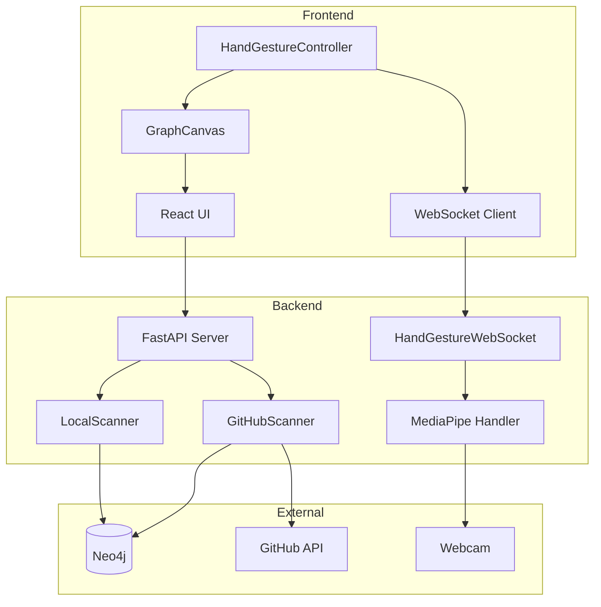
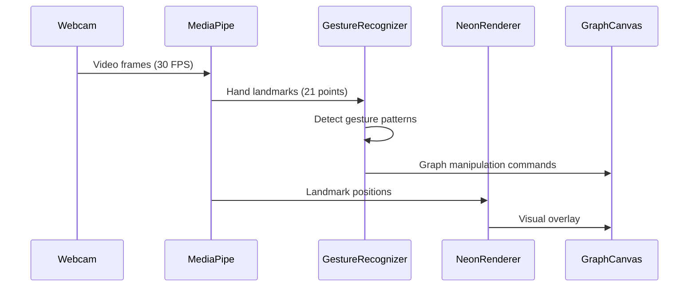

# Design Document: Enhanced Scanner with Hand Control

## Overview

This design extends the InsightGraph system with two major capabilities:

1. **Enhanced Scanner Architecture**: Dual-mode scanning supporting both local filesystem analysis and remote GitHub repository analysis with intelligent caching and incremental updates
2. **Hand Gesture Controller (Beta)**: Real-time hand tracking using MediaPipe and OpenCV with neon visual effects for gesture-based graph manipulation

The enhanced scanner provides flexible code analysis workflows, while the hand gesture controller introduces an innovative interaction paradigm for exploring and manipulating dependency graphs through natural hand movements captured via webcam.

### Key Design Goals

- Maintain backward compatibility with existing scanner infrastructure
- Provide seamless switching between local and GitHub scanning modes
- Deliver real-time hand tracking with <100ms latency
- Create visually striking neon effects for gesture feedback
- Ensure graceful degradation when hardware/permissions are unavailable
- Optimize performance to prevent UI blocking during video processing

## Architecture

### System Context



### Scanner Architecture

The scanner system follows a strategy pattern with two concrete implementations:

1. **LocalScanner**: Processes code from local filesystem directories
2. **GitHubScanner**: Clones remote repositories to temporary directories, then delegates to LocalScanner

Both scanners share common infrastructure:
- Tree-sitter parsers (Java, TypeScript, SQL)
- Neo4j persistence layer
- RAG embedding generation
- Progress reporting via SSE
- Incremental update support

### Hand Gesture Controller Architecture

The hand gesture system operates as a separate processing pipeline:



## Components and Interfaces

### 1. Enhanced Scanner Components

#### 1.1 ScannerOrchestrator

**Responsibility**: Coordinates scan execution and mode selection

**Interface**:
```python
class ScannerOrchestrator:
    async def execute_scan(
        self,
        mode: Literal["local", "github"],
        paths: list[str] = None,
        github_config: GitHubConfig = None
    ) -> ScanResult
    
    async def get_scan_status(self) -> ScanStatus
    
    async def cancel_scan(self) -> bool
```

**Key Methods**:
- `execute_scan()`: Validates configuration, selects appropriate scanner, executes in background task
- `get_scan_status()`: Returns current progress (files processed, nodes created, percentage)
- `cancel_scan()`: Interrupts running scan and cleans up resources

#### 1.2 LocalScanner

**Responsibility**: Scans local filesystem directories

**Interface**:
```python
class LocalScanner:
    def __init__(
        self,
        neo4j_service: Neo4jService,
        rag_store: RagStore,
        parsers: dict[str, Parser],
        state_store: LocalStateStore
    )
    
    async def scan_directories(
        self,
        paths: list[str],
        progress_callback: Callable[[ScanProgress], None]
    ) -> ScanResult
    
    def _identify_files(self, directory: Path) -> list[Path]
    
    def _process_file(self, file_path: Path) -> ParsedFileData
```

**Key Behaviors**:
- Recursively walks directory trees
- Filters files by extension (.java, .ts, .tsx, .sql)
- Delegates parsing to appropriate Tree-sitter parser
- Extracts nodes (classes, methods, functions) and edges (calls, imports)
- Calculates metrics (complexity, coupling, hotspot scores)
- Persists to Neo4j and memory graph
- Updates RAG embeddings
- Reports progress every 10 files

#### 1.3 GitHubScanner

**Responsibility**: Clones and scans GitHub repositories

**Interface**:
```python
class GitHubScanner:
    def __init__(
        self,
        local_scanner: LocalScanner,
        temp_dir: Path
    )
    
    async def scan_repository(
        self,
        config: GitHubConfig,
        progress_callback: Callable[[ScanProgress], None]
    ) -> ScanResult
    
    def _clone_repository(
        self,
        repository: str,
        branch: str,
        token: str = None,
        shallow: bool = True
    ) -> Path
    
    def _cleanup_temp_directory(self, path: Path) -> None
```

**Key Behaviors**:
- Validates repository format (owner/repo)
- Constructs git clone command with authentication
- Uses `--depth=1` for shallow clones when enabled
- Clones to temporary directory with unique name
- Delegates scanning to LocalScanner
- Cleans up temporary directory on completion or error
- Handles authentication errors with descriptive messages

**GitHubConfig Model**:
```python
@dataclass
class GitHubConfig:
    repository: str  # Format: "owner/repo"
    branch: str = "main"
    token: str = None
    shallow_clone: bool = True
```

### 2. Hand Gesture Controller Components

#### 2.1 HandGestureController (Frontend)

**Responsibility**: Manages webcam access and WebSocket connection

**Interface**:
```typescript
class HandGestureController {
  constructor(
    graphCanvas: GraphCanvasHandle,
    onError: (error: string) => void
  )
  
  async activate(): Promise<void>
  
  deactivate(): void
  
  isActive(): boolean
  
  getPreviewStream(): MediaStream | null
}
```

**Key Behaviors**:
- Requests webcam permission via `navigator.mediaDevices.getUserMedia()`
- Establishes WebSocket connection to `/ws/hand-tracking`
- Sends video frames to backend for processing
- Receives landmark data and gesture commands
- Forwards commands to GraphCanvas
- Manages preview video element
- Handles connection errors and reconnection

#### 2.2 MediaPipeHandler (Backend)

**Responsibility**: Processes video frames and extracts hand landmarks

**Interface**:
```python
class MediaPipeHandler:
    def __init__(self, confidence: float = 0.7)
    
    def process_frame(self, frame: np.ndarray) -> HandLandmarks
    
    def shutdown(self) -> None
```

**Key Behaviors**:
- Initializes MediaPipe Hands with specified confidence threshold
- Processes frames at 640x480 resolution
- Detects up to 2 hands per frame
- Extracts 21 landmarks per hand (normalized 0-1 coordinates)
- Calculates fingertip velocities between frames
- Runs in separate thread to avoid blocking
- Releases resources on shutdown

**HandLandmarks Model**:
```python
@dataclass
class HandLandmarks:
    hand_id: int
    landmarks: list[tuple[float, float, float]]  # (x, y, z) normalized
    velocities: list[float]  # Per-fingertip velocity
    timestamp: float
```

#### 2.3 GestureRecognizer

**Responsibility**: Identifies gesture patterns from landmarks

**Interface**:
```python
class GestureRecognizer:
    def recognize(self, landmarks: HandLandmarks) -> Gesture | None
    
    def _detect_pinch(self, landmarks: HandLandmarks) -> bool
    
    def _detect_open_hand(self, landmarks: HandLandmarks) -> bool
    
    def _detect_fist(self, landmarks: HandLandmarks) -> bool
    
    def _detect_v_sign(self, landmarks: HandLandmarks) -> bool
```

**Supported Gestures**:
- **Pinch**: Thumb and index finger within 30px distance → Select node
- **Open Hand**: All 5 fingers extended → Drag node
- **Fist**: All fingers closed → Deselect node
- **V Sign**: Index and middle finger extended, others closed → Zoom in
- **Closing V**: V sign with fingers moving together → Zoom out
- **Palm Forward**: Palm facing camera, fingers up → Pause tracking

**Gesture Model**:
```python
@dataclass
class Gesture:
    type: GestureType
    position: tuple[float, float]  # Normalized coordinates
    confidence: float
    timestamp: float

class GestureType(Enum):
    PINCH = "pinch"
    OPEN_HAND = "open_hand"
    FIST = "fist"
    V_SIGN = "v_sign"
    CLOSING_V = "closing_v"
    PALM_FORWARD = "palm_forward"
```

#### 2.4 NeonRenderer (Frontend)

**Responsibility**: Renders visual effects for hand tracking

**Interface**:
```typescript
class NeonRenderer {
  constructor(canvas: HTMLCanvasElement)
  
  render(landmarks: HandLandmarks[]): void
  
  setColorCycle(enabled: boolean): void
  
  clear(): void
}
```

**Visual Effects**:
- Black background (RGB 0, 0, 0)
- Neon circles at fingertips (radius 8px)
- Glowing lines from fingertips to palm center
- Particle trails along lines (fade over 500ms)
- Color cycling: cyan → magenta → blue (3s transitions)
- Velocity-based brightness (faster movement = brighter)
- Thin threads between adjacent fingertips
- Gaussian blur for glow effect (radius 10px)
- 30 FPS minimum rendering

**Color Palette**:
```typescript
const NEON_COLORS = {
  cyan: '#00FFFF',
  magenta: '#FF00FF',
  blue: '#0080FF'
}
```

#### 2.5 HandGestureWebSocket (Backend)

**Responsibility**: WebSocket endpoint for hand tracking data streaming

**Interface**:
```python
@app.websocket("/ws/hand-tracking")
async def hand_tracking_websocket(websocket: WebSocket):
    await websocket.accept()
    
    handler = MediaPipeHandler()
    recognizer = GestureRecognizer()
    
    try:
        while True:
            # Receive frame from client
            frame_data = await websocket.receive_bytes()
            frame = decode_frame(frame_data)
            
            # Process with MediaPipe
            landmarks = handler.process_frame(frame)
            
            # Recognize gestures
            gesture = recognizer.recognize(landmarks)
            
            # Send back to client
            await websocket.send_json({
                "landmarks": landmarks.to_dict(),
                "gesture": gesture.to_dict() if gesture else None
            })
    finally:
        handler.shutdown()
```

### 3. Integration Components

#### 3.1 GraphCanvas Integration

**Responsibility**: Accepts gesture commands and updates graph visualization

**Enhanced Interface**:
```typescript
interface GraphCanvasHandle {
  // Existing methods
  selectNode(nodeKey: string): void
  moveNode(nodeKey: string, position: { x: number, y: number }): void
  zoomTo(level: number): void
  
  // New gesture methods
  selectNodeByPosition(x: number, y: number): string | null
  moveSelectedNode(deltaX: number, deltaY: number): void
  setGestureMode(enabled: boolean): void
  showVirtualCursor(position: { x: number, y: number }): void
  hideVirtualCursor(): void
}
```

**Gesture Integration Behaviors**:
- Maps normalized hand coordinates (0-1) to canvas coordinates
- Applies smoothing filter to reduce jitter (exponential moving average, alpha=0.3)
- Highlights selected node with neon border (3px, cyan)
- Shows virtual cursor as neon circle (radius 15px) at hand position
- Flashes cursor on gesture recognition (200ms pulse)
- Maintains compatibility with mouse/touch events
- Persists node positions after gesture manipulation

#### 3.2 Scanner API Endpoints

**POST /api/scan**

Request:
```json
{
  "mode": "local" | "github",
  "paths": ["string"],  // For local mode
  "github_config": {    // For github mode
    "repository": "owner/repo",
    "branch": "main",
    "token": "ghp_xxx",
    "shallow_clone": true
  }
}
```

Response: `202 Accepted`
```json
{
  "scan_id": "uuid",
  "status": "queued"
}
```

**GET /api/scan/status**

Response: `200 OK`
```json
{
  "status": "scanning" | "completed" | "error",
  "scanned_files": 42,
  "total_files": 100,
  "total_nodes": 523,
  "total_relationships": 1247,
  "progress_percent": 42.0,
  "current_file": "/path/to/file.java",
  "errors": ["string"]
}
```

**POST /api/scan/cancel**

Response: `200 OK`
```json
{
  "cancelled": true,
  "cleanup_status": "completed"
}
```

**WS /ws/hand-tracking**

Client → Server (binary):
```
[JPEG frame bytes]
```

Server → Client (JSON):
```json
{
  "landmarks": [
    {
      "hand_id": 0,
      "points": [[0.5, 0.3, 0.1], ...],  // 21 points
      "velocities": [0.02, 0.01, ...]     // 5 fingertip velocities
    }
  ],
  "gesture": {
    "type": "pinch",
    "position": [0.5, 0.3],
    "confidence": 0.92
  }
}
```

## Data Models

### Scanner Data Models

```python
@dataclass
class ScanProgress:
    scanned_files: int
    total_files: int
    total_nodes: int
    total_relationships: int
    progress_percent: float
    current_file: str
    errors: list[str]

@dataclass
class ScanResult:
    status: Literal["completed", "error", "cancelled"]
    nodes_created: int
    relationships_created: int
    duration_seconds: float
    errors: list[str]

@dataclass
class ParsedFileData:
    file_path: str
    nodes: list[dict]  # Extracted entities
    edges: list[dict]  # Dependencies
    metrics: dict      # Complexity, LOC, etc.
```

### Hand Tracking Data Models

```python
@dataclass
class HandLandmark:
    x: float  # Normalized 0-1
    y: float  # Normalized 0-1
    z: float  # Depth (relative)

@dataclass
class HandLandmarks:
    hand_id: int
    landmarks: list[HandLandmark]  # 21 points
    velocities: list[float]        # 5 fingertip velocities
    timestamp: float

@dataclass
class Gesture:
    type: GestureType
    position: tuple[float, float]
    confidence: float
    timestamp: float
```

### Frontend State Models

```typescript
interface HandGestureState {
  active: boolean
  webcamPermission: 'granted' | 'denied' | 'prompt'
  connected: boolean
  fps: number
  latency: number
  error: string | null
}

interface ScannerConfig {
  mode: 'local' | 'github'
  localPaths: string[]
  githubRepository: string
  githubBranch: string
  githubToken: string
  githubShallowClone: boolean
}
```

## Error Handling

### Scanner Error Handling

**Local Scanner Errors**:
- **Directory Not Found**: Return 400 with message "Directory does not exist: {path}"
- **Permission Denied**: Log warning, skip file, continue scan
- **Parse Error**: Log error with file path, add to errors list, continue scan
- **Neo4j Connection Lost**: Fall back to memory-only mode, log warning
- **Out of Memory**: Cancel scan, return 500 with message "Insufficient memory"

**GitHub Scanner Errors**:
- **Invalid Repository Format**: Return 400 with message "Invalid repository format. Expected: owner/repo"
- **Authentication Failed**: Return 401 with message "GitHub authentication failed. Check token."
- **Repository Not Found**: Return 404 with message "Repository not found: {repo}"
- **Clone Timeout**: Return 408 with message "Repository clone timed out after 5 minutes"
- **Disk Space Insufficient**: Return 507 with message "Insufficient disk space for clone"

**Error Recovery**:
- All scan errors are logged to `scan_state.errors` list
- Scan continues processing remaining files after individual file errors
- Temporary directories are cleaned up even on error
- Neo4j transactions are rolled back on error
- SSE "scan_error" event is emitted with error details

### Hand Gesture Controller Error Handling

**Webcam Errors**:
- **No Webcam Detected**: Show toast "Webcam not found. Please connect a webcam."
- **Permission Denied**: Show modal with instructions to enable webcam in browser settings
- **Webcam In Use**: Show toast "Webcam is being used by another application"
- **Webcam Disconnected**: Auto-deactivate controller, show toast "Webcam disconnected"

**MediaPipe Errors**:
- **Model Load Failed**: Show toast "Failed to load hand tracking model. Check internet connection."
- **Processing Error**: Log to console, continue with next frame
- **Out of Memory**: Reduce resolution to 320x240, show warning "Performance mode activated"

**WebSocket Errors**:
- **Connection Failed**: Retry 3 times with exponential backoff (1s, 2s, 4s)
- **Connection Lost**: Show reconnecting indicator, attempt reconnection
- **Max Retries Exceeded**: Deactivate controller, show error "Connection to server lost"
- **Invalid Data**: Log warning, skip frame, continue processing

**Performance Degradation**:
- **FPS < 15**: Show warning "Low frame rate detected. Consider closing other applications."
- **Latency > 100ms**: Show warning "High latency detected. Performance may be affected."
- **CPU > 80%**: Automatically reduce FPS to 20, show info "Performance optimized"

**Graceful Degradation**:
- If MediaPipe fails, fall back to "tracking only" mode (no gesture recognition)
- If rendering performance drops, reduce particle count and disable blur
- If WebSocket fails, allow local-only preview without backend processing

## Testing Strategy

This feature involves infrastructure integration, real-time video processing, external hardware, and UI rendering. Property-based testing is not applicable. The testing strategy focuses on:

### Unit Tests

**Scanner Components**:
- `LocalScanner._identify_files()`: Test file filtering by extension
- `LocalScanner._process_file()`: Test parsing with mock Tree-sitter output
- `GitHubScanner._clone_repository()`: Test git command construction
- `ScannerOrchestrator.execute_scan()`: Test mode selection logic
- `GestureRecognizer._detect_pinch()`: Test distance calculation with known landmarks
- `GestureRecognizer._detect_open_hand()`: Test finger extension detection

**Hand Gesture Components**:
- `GestureRecognizer.recognize()`: Test each gesture pattern with synthetic landmarks
- `NeonRenderer.render()`: Test canvas drawing with mock landmarks
- Coordinate mapping functions: Test normalization and canvas transformation

### Integration Tests

**Scanner Integration**:
- End-to-end local scan with sample Java/TypeScript project
- End-to-end GitHub scan with public test repository
- Verify Neo4j persistence after scan
- Verify RAG embeddings are created
- Verify SSE events are emitted
- Test scan cancellation and cleanup

**Hand Gesture Integration**:
- WebSocket connection establishment and data flow
- MediaPipe processing with recorded video frames
- Gesture command execution on GraphCanvas
- Visual rendering with real landmark data

### Mock-Based Tests

**External Dependencies**:
- Mock `subprocess.run()` for git clone commands
- Mock `cv2.VideoCapture()` for webcam access
- Mock MediaPipe `Hands.process()` for landmark extraction
- Mock Neo4j graph operations
- Mock WebSocket connections

### End-to-End Tests

**Scanner Workflows**:
1. Configure local scan → Execute → Verify graph updated
2. Configure GitHub scan → Execute → Verify clone and graph updated
3. Start scan → Cancel mid-execution → Verify cleanup

**Hand Gesture Workflows**:
1. Activate controller → Grant permission → Verify webcam active
2. Perform pinch gesture → Verify node selected
3. Perform drag gesture → Verify node moved
4. Deactivate controller → Verify resources released

### Performance Tests

**Scanner Performance**:
- Measure scan time for 1000-file repository
- Verify memory usage stays below 2GB during scan
- Verify Neo4j write throughput (>100 nodes/sec)

**Hand Gesture Performance**:
- Measure end-to-end latency (webcam → gesture command)
- Verify FPS stays above 30 under normal load
- Verify CPU usage stays below 50% during tracking
- Measure WebSocket message throughput

### Browser Compatibility Tests

- Test webcam access on Chrome, Firefox, Safari, Edge
- Test WebSocket connection on all major browsers
- Test canvas rendering performance across browsers
- Verify getUserMedia API availability

### Error Scenario Tests

- Test behavior when webcam permission is denied
- Test behavior when webcam is disconnected mid-session
- Test behavior when GitHub token is invalid
- Test behavior when repository doesn't exist
- Test behavior when disk space is insufficient
- Test behavior when Neo4j is unavailable

## Performance Optimizations

### Scanner Optimizations

1. **Parallel File Processing**: Process multiple files concurrently using asyncio tasks (max 4 concurrent)
2. **Batch Neo4j Writes**: Accumulate 50 nodes before writing to reduce transaction overhead
3. **Incremental RAG Updates**: Only update embeddings for changed nodes
4. **Shallow Clones**: Use `--depth=1` for GitHub clones to reduce download time
5. **File Filtering**: Skip non-code files early (node_modules, .git, build artifacts)
6. **Memory Management**: Clear parsed ASTs after processing each file
7. **Progress Throttling**: Report progress every 10 files to reduce SSE overhead

### Hand Gesture Optimizations

1. **Resolution Reduction**: Process frames at 640x480 instead of full HD
2. **Frame Rate Limiting**: Cap at 30 FPS to reduce CPU load
3. **Thread Separation**: Run MediaPipe inference in separate thread from rendering
4. **Debouncing**: Apply 100ms debounce to gesture recognition to prevent false positives
5. **Smoothing**: Use exponential moving average (alpha=0.3) for hand position
6. **Particle Pooling**: Reuse particle objects instead of creating new ones
7. **Canvas Optimization**: Use requestAnimationFrame for rendering
8. **WebSocket Compression**: Enable permessage-deflate for landmark data
9. **Adaptive Quality**: Reduce FPS and resolution if CPU usage exceeds 80%
10. **Lazy Model Loading**: Load MediaPipe model only when controller is activated

### Memory Optimizations

1. **Frame Buffer Clearing**: Clear video frame buffers every 60 frames
2. **Landmark History Pruning**: Keep only last 10 frames of landmark data
3. **Temporary Directory Cleanup**: Delete cloned repositories immediately after scan
4. **Connection Pooling**: Reuse Neo4j connections across scans
5. **Garbage Collection Hints**: Explicitly delete large objects after use

## Security Considerations

### Scanner Security

1. **Path Traversal Prevention**: Validate that local paths don't escape allowed directories
2. **GitHub Token Protection**: Store tokens in localStorage with encryption, never log tokens
3. **Repository Validation**: Sanitize repository names to prevent command injection
4. **Temporary Directory Isolation**: Use unique random names for temp directories
5. **Resource Limits**: Enforce maximum repository size (500MB) and scan timeout (30 minutes)

### Hand Gesture Security

1. **Webcam Permission**: Request explicit user permission before accessing webcam
2. **Frame Data Privacy**: Process frames locally, don't store or transmit to external services
3. **WebSocket Authentication**: Validate WebSocket connections with session tokens
4. **Resource Limits**: Limit WebSocket message size to prevent DoS
5. **HTTPS Requirement**: Require HTTPS for webcam access (browser security policy)

## Deployment Considerations

### Backend Dependencies

```bash
# Python dependencies
pip install mediapipe opencv-python-headless

# System dependencies (Linux)
apt-get install libgl1-mesa-glx libglib2.0-0

# System dependencies (macOS)
brew install opencv
```

### Frontend Dependencies

```bash
npm install @mediapipe/hands @mediapipe/drawing_utils
```

### Environment Variables

```bash
# Scanner configuration
GITHUB_CLONE_TIMEOUT=300  # seconds
MAX_REPOSITORY_SIZE_MB=500
SCAN_CONCURRENCY=4

# Hand gesture configuration
MEDIAPIPE_CONFIDENCE=0.7
HAND_TRACKING_FPS=30
HAND_TRACKING_RESOLUTION=640x480
WEBSOCKET_MAX_MESSAGE_SIZE=1048576  # 1MB
```

### Hardware Requirements

**Minimum**:
- CPU: Quad-core 2.0 GHz
- RAM: 4GB
- Webcam: 720p @ 30fps
- GPU: Not required (CPU inference)

**Recommended**:
- CPU: Hexa-core 3.0 GHz
- RAM: 8GB
- Webcam: 1080p @ 60fps
- GPU: Dedicated GPU for MediaPipe acceleration

### Browser Requirements

- Chrome 87+ (recommended)
- Firefox 94+
- Safari 15+
- Edge 87+
- Requires: getUserMedia API, WebSocket, Canvas 2D

## Future Enhancements

### Scanner Enhancements

1. **GitLab/Bitbucket Support**: Extend to other Git hosting platforms
2. **Incremental GitHub Sync**: Pull only changed files instead of full clone
3. **Multi-Repository Scanning**: Scan multiple repositories in parallel
4. **Custom Parser Plugins**: Allow user-defined parsers for additional languages
5. **Scan Scheduling**: Periodic automatic scans with cron-like configuration

### Hand Gesture Enhancements

1. **Custom Gesture Training**: Allow users to define custom gestures
2. **Multi-Hand Gestures**: Support gestures requiring both hands
3. **Voice Commands**: Combine gestures with voice for complex operations
4. **AR Overlay**: Project graph onto physical space using AR
5. **Gesture Macros**: Record and replay gesture sequences
6. **Haptic Feedback**: Vibrate controller when gesture is recognized (mobile)
7. **Eye Tracking**: Combine hand gestures with gaze direction for precision

### Integration Enhancements

1. **Gesture-Based Annotations**: Add annotations to nodes using gestures
2. **Gesture-Based Filtering**: Filter graph by drawing shapes in the air
3. **Collaborative Gestures**: Multiple users controlling graph simultaneously
4. **Gesture Analytics**: Track which gestures are most used
5. **Accessibility Mode**: Alternative input methods for users without webcam

---

**Document Version**: 1.0  
**Last Updated**: 2024  
**Status**: Ready for Implementation
