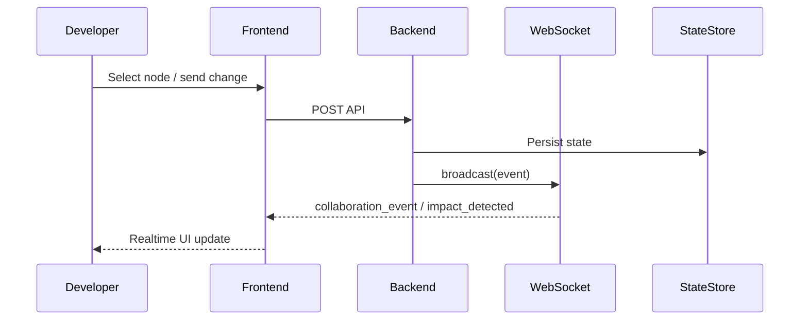

# Developer Guide

## Architecture Overview
- **Backend**: FastAPI + SQLite state store + optional Redis/PostgreSQL.
- **Realtime**: EventStream (SSE) + WebSocketManager (bi-directional).
- **Prediction**: `PredictionEngine` + `PredictiveImpactEngine`.
- **Collaboration**: `CollaborationManager` + `ChatManager`.
- **Auto Healer**: `AutoHealer` for patterns/fixes/tests/docs.

## Event Flow
1. Scan/commit change triggers graph update.
2. Impact propagation publishes events.
3. Clients receive SSE/WebSocket updates.
4. Frontend updates GraphCanvas incrementally.

## Extending the Platform
- Add endpoints in `backend/main.py`.
- Persist entities in `backend/state_store.py`.
- Add real-time events in:
  - `backend/event_stream.py`
  - `frontend/src/utils/sse-types.ts`
  - `frontend/src/hooks/useWebSocket.ts`

## Sequence Diagram

